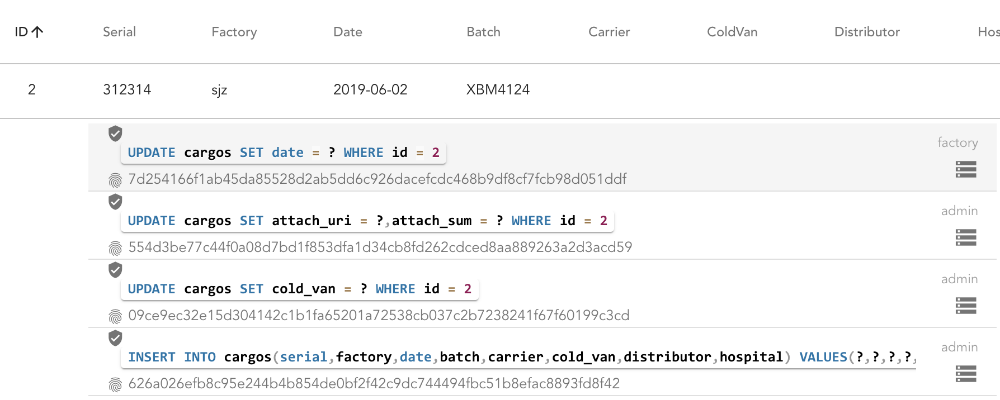
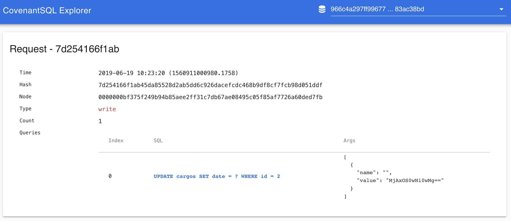

# Data Sharing Demo
Data Sharing Demo (DSD)是一个基于 [CovenantSQL（CQL）](https://github.com/CovenantSQL/CovenantSQL/blob/develop/README-zh.md)构建的数据共享平台的演示。

演示的场景是一个基于：药监局、制药厂、物流公司、医院的多方场景。通过将 CQL DB Miner 节点部署在这几个角色的服务器中，并通过区块链的方式保证数据库的一致性，可以搭建出一个类似于 Hyperledger Fabric 联盟链系统。但 CQL 提供传统的 SQL 使开发更为低成本，各方面的性能也更出色。详细的对比可以参见[【这里】]([https://github.com/CovenantSQL/CovenantSQL/blob/develop/README-zh.md#%E9%A1%B9%E7%9B%AE%E5%AF%B9%E6%AF%94](https://github.com/CovenantSQL/CovenantSQL/blob/develop/README-zh.md#项目对比))

对于制药厂，只需要通过简单把 ERP 系统中生产情况的数据，例如：序列号、批号、生产日期，通过 SQL 写入到 CQL 中即可，对于数据的添加和修改都是基于 Admin 在系统中设定的权限来保证的，例如：

```yaml
Grants:
  Policies:
    - User: factory_r_group
      Field: b77422b.cargos.id
      Action: read
    - User: factory_r_group
      Field: b77422b.cargos.serial
      Action: read
    - User: factory_w_group
      Field: b77422b.cargos.id
      Action: write
    - User: factory_w_group
      Field: b77422b.cargos.serial
      Action: write
      ## 省略很多行
  UserGroups:
    admin_group:
      - admin
    factory_r_group:
      - factory
      - carrier
      - hospital
    factory_w_group:
      - factory
    read_group:
      - readonly
```

在 Demo 中，每个用户只能看到有 Read 权限的数据列，只能修改有 Write 权限的列。

同时，所有对于数据的修改操作都是在区块链浏览器上有据可查的：



点击每条记录可以跳转到 SQLChain Explorer 上查看区块链上的详情：

<p align="center">
    
</p>

### 游览

目前可以通过以下 4 组账号进行平台试用，Admin 账号暂不开放:

```bash
 factory: AUZzFq4X  # 制药厂
 carrier: a0c48c12  # 物流公司
 hospital: DCa861a1 # 医院
 readonly: jhAWQTnh # 药监局
```


### 文件上传

在修改和增加数据条目的时候可以上传图片作为附件，后端支持本地文件系统和 S3，上传后的文件我们会在 CQL 数据库中记录文件的 URI 和 MD5。

<p align="center">
    
</p>


### 安全性

CQL Miner 本身支持在数据库引擎的层面进行落盘加密，也就是所有在磁盘上的数据都经过 AES-128 进行加密。

对安全有更高要求的客户可以选用 CQL `端到端加密` 的方案对数据进行加解密，在 demo 中我们使用的是 JavaScript 在浏览器端进行加解密：

<p align="center">
    
</p>


### 数据同步演示

这里展示的是这个 Demo 背后的数据库实例是怎么进行强一致性的数据同步的，在 Demo 中进行任何数据的修改都会触发动画（本人学了一周前端，水平太菜，不能触发的话请刷新几下页面）：


### 架构图


### 原理

CQL 是 CovenantLabs 开发的`分布式` `拜占庭容错` `关系型` 数据库，拥有基于 RBAC 的库、表、行、列级别的权限限制的功能。我们可以基于 CQL 用传统的 SQL 技术快速的开发一个 `联盟链` 系统，用于实现基于区块链技术的可信多方数据共享。

#### 接口

CQL 测试网已经发布，[尝试一下](https://developers.covenantsql.io/docs/quickstart).


- [Golang](client/)
- [Java](https://github.com/CovenantSQL/cql-java-driver)
- [NodeJS](https://github.com/CovenantSQL/node-covenantsql)
- [Python](https://github.com/CovenantSQL/cql-python-driver)
- [Microsoft Excel (来自社区)](https://github.com/melancholiaforever/CQL_Excel)
- Coding for more……

关注我们或[](https://twitter.com/intent/follow?screen_name=CovenantLabs) 保持更新

## 联系我们

- [博客](https://medium.com/@covenant_labs)
- [YouTube](https://www.youtube.com/channel/UCe9P_TMiexSHW2GGV5qBmZw)
- [邮箱地址](mailto:webmaster@covenantsql.io)
- [论坛](https://demo.covenantsql.io/forum/)
- <a href="https://twitter.com/intent/follow?screen_name=CovenantLabs">
          </a>
- [](https://gitter.im/CovenantSQL/CovenantSQL?utm_source=badge&utm_medium=badge&utm_campaign=pr-badge&utm_content=badge)
- 添加微信: `CovenantSQL` 加入交流群
    <p align="left">
        
    </p>

